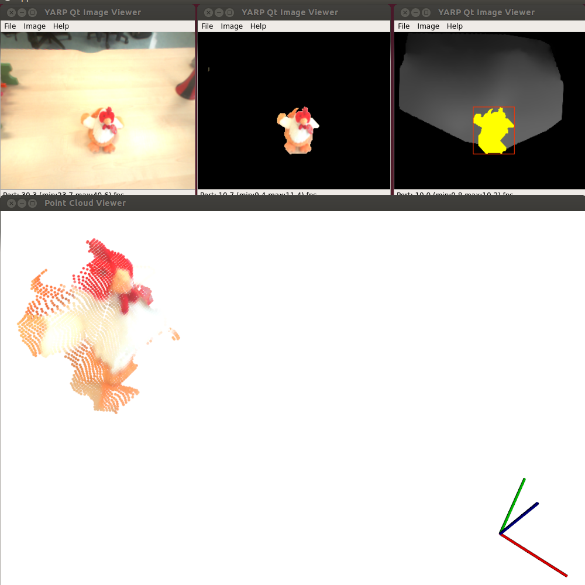
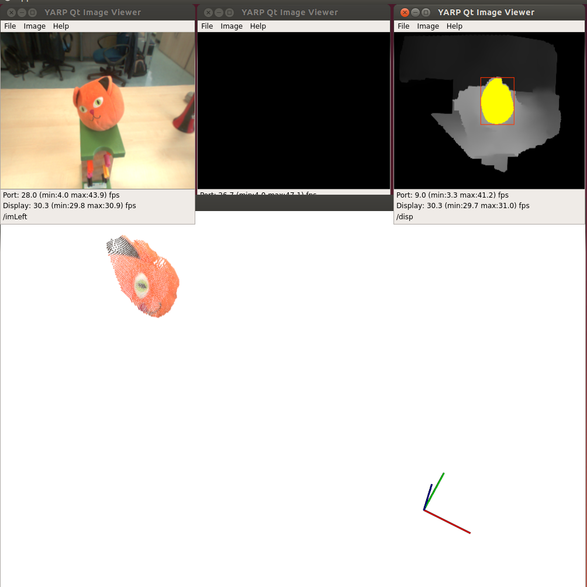
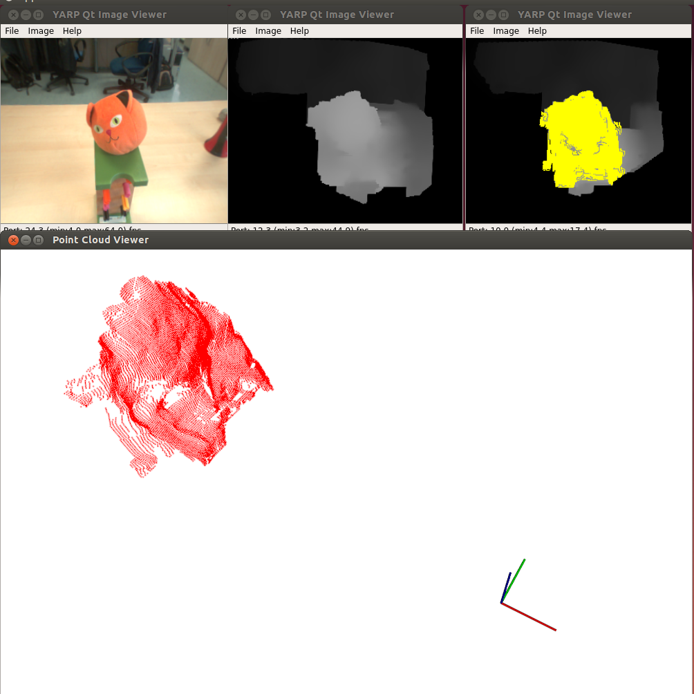
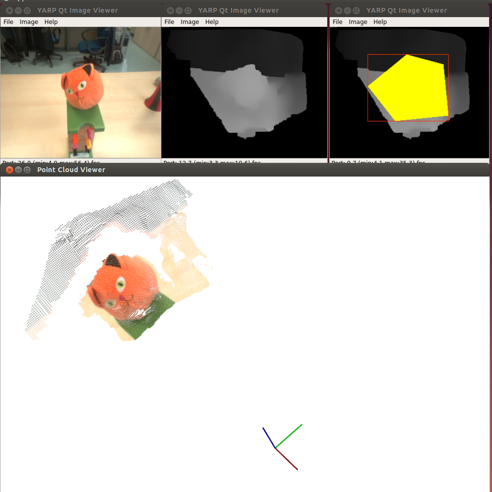

# seg2cloud
Module to capture pointclouds from segmented regions in 2D or 2.5D (depth) images 

## Description
This module combines disparity and segmentation information in order to retrieve 3D clouds of desired 2D regions. These regions can be chosen from a user defined polygon, from a segmentation algorithm, or from 2D (in color) or 3D (in depth) flood filling. When using segmentation modules (2D or 3D), seeding can be performed automatically.

## Dependencies
- [YARP](https://github.com/robotology/yarp)
- [iCub](https://github.com/robotology/icub-main)
- [icub-contrib-common](https://github.com/robotology/icub-contrib-common)
- [OpenCV](http://opencv.org/)
- [SFM](https://github.com/robotology/stereo-vision)

## Reconstruction Options
This modules interfaces between segmentation modules and SFM in order to provide the 3D reconstruction of an object delimited by a contour in the image. In order to obtain this contour, 4 modes are provided:

- **seg:** 2D segmentation (requires external segmentation module). When this option is called, the contour is provided by an external segmentation module. 
- **flood:** 2D color flood. The object's contour is obtained by performing a 2D color flood, based on the thresholding parameter *color_distance*.
- **flood3D** 3D depth flood. The contour is determined by a flood operation performed on the depth image, controlled by the thresholding parameter *space_distance*. 
- **polygon** User selected polygon contour. The contour is provided by the user as a contour by selecting the vertices on a connected yarpview window.

## Seed feeding options
In order to select which of the possible regions of the image is segmented, a seed usually needs to be provided. In this module, the seed can be provided in several different ways: 
- In the three first options above (`seg`, `flood` and `flood3d`) the initial seed to perform segmentation can be provided in 3 different ways: 
- If parameter `seedAuto` is set to *true*, the seed will be obtained automatically. 
  - In segmentations options `seg` and `flood`, seed has to be provided by a tracker whose ooutput (u v coordinates) is connected to the `/seg2cloud/seed:i` port.
  - If the segmentation option is `flood3d`, the seed is computed automatically as the center of the closest blob (as in the disbBlobber module).
- If parameter `seedAuto` is set to *false*, the seed can be coveyed in 2 further ways:
  - By clicking on a connected yarpview window whose output is connected to the `/seg2cloud/seed:i`port.
  - As *explicit u v coordinates* given after the segmentation command. For example <tt> seg 102 175 </tt>.
- In the case where the segmentation option is set to `polygon`, no seed is needed, as the region is fully provided by the user.

The results obtained with each of these options can be observed below.

## Images of reconstruction results: 

### seg (2D segmentation provided by [lbpExptract](https://github.com/robotology/segmentation/tree/master/lbpExtract))

### flood (2D color flood)

### flood3D (3D spatial flood)

### polygon (Selected polygon segmentation)

## Documentation 
Online documentation is available here:  [http://robotology.github.com/segmentation-to-pointcloud](http://robotology.github.com/segmentation-to-pointcloud).

## License
Material included here is Copyright of _iCub Facility - Istituto Italiano di Tecnologia_
and is released under the terms of the GPL v2.0 or later. See the file LICENSE for details.

